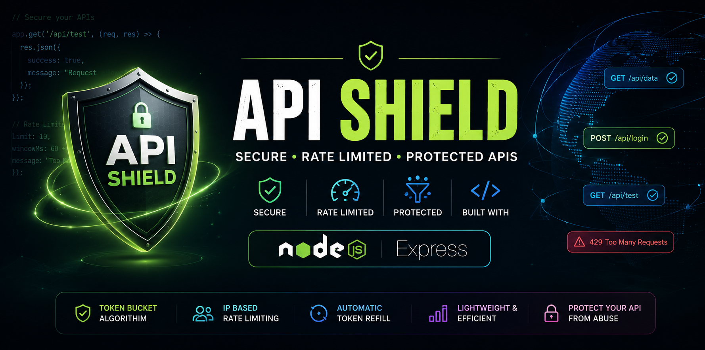
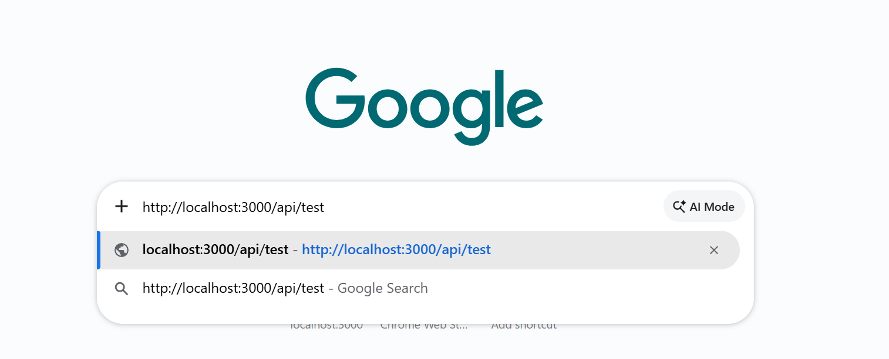
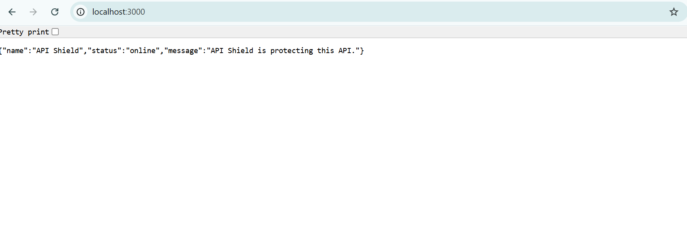
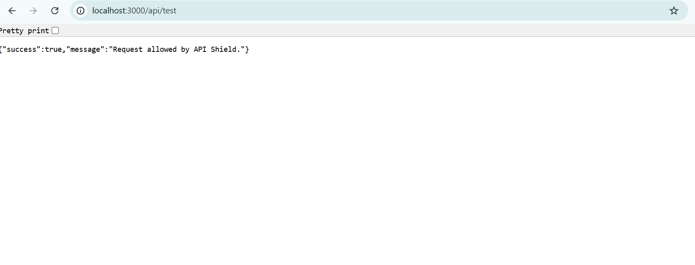

# 🛡️ API Shield

<p align="center">
  
</p>

<h3 align="center">
  🔐 Secure • Rate Limited • Protected APIs
</h3>

<p align="center">
  A lightweight Node.js and Express API protection system with built-in rate limiting.
</p>

---

## 🚀 About

**API Shield** is a simple API security project built using **Node.js** and **Express.js**.

It helps protect APIs from excessive requests by applying rate limiting and returning a clear response when the request limit is exceeded.

### ✨ Features

- 🔐 API Protection
- 🚦 Rate Limiting
- 🛡️ Prevents excessive requests
- ⚡ Lightweight and fast
- 🟢 Simple Express.js implementation
- 📡 Easy API testing
- 💻 Beginner-friendly project

---

## 🛠️ Technologies Used

| Technology | Purpose |
|------------|---------|
| 🟢 Node.js | Backend runtime |
| 🚂 Express.js | Web framework |
| 🚦 Rate Limiter | Request control |
| 📦 npm | Package management |
| 🔧 Git | Version control |
| 🐙 GitHub | Project hosting |

---

## 📁 Project Structure

```text
API-Shield/
│
├── assets/
│   ├── banner.png
│   ├── home.png
│   ├── api-test.png
│   └── rate-limit.png
│
├── src/
│   ├── server.js
│   └── rateLimiter.js
│
├── .gitignore
├── package.json
├── package-lock.json
└── README.md
```

---

## ⚙️ Installation

Clone the repository:

```bash
git clone https://github.com/madheshw265-lang/API-Shield.git
```

Go into the project folder:

```bash
cd API-Shield
```

Install dependencies:

```bash
npm install
```

---

## ▶️ How to Run

Start the server:

```bash
node src/server.js
```

You should see:

```text
Server running at http://localhost:3000
```

---

## 🌐 API Endpoints

### 🏠 Home

```text
GET /
```

Response:

```json
{
  "name": "API Shield",
  "status": "online",
  "message": "API Shield is protecting this API."
}
```

### 🧪 Test API

```text
GET /api/test
```

Response:

```json
{
  "success": true,
  "message": "Request allowed by API Shield."
}
```

---

## 🚦 Rate Limiting

API Shield limits the number of requests that can be sent within a specific time window.

When the request limit is exceeded, the API returns:

```json
{
  "error": "Too Many Requests",
  "message": "Rate limit exceeded. Please try again later."
}
```

This helps protect APIs from excessive or abusive requests.

---

# 📸 Screenshots

## 🏠 API Shield Home

<p align="center">
  
</p>

---

## 🧪 API Test

<p align="center">
  
</p>

---

## 🚦 Rate Limit Protection

<p align="center">
  
</p>

---

---

## 🎥 Project Demo

<p align="center">
  <a href="assets/demo/Api-Shield.mp4">
    ▶️ Watch API Shield Demo
  </a>
</p>

---

## 🔄 How It Works

```text
Client Request
      │
      ▼
   API Shield
      │
      ▼
 Rate Limiter
      │
 ┌────┴─────┐
 │          │
 ▼          ▼
Allowed   Limit Exceeded
 │          │
 ▼          ▼
API       429 Error
Response
```

---

## 🎯 Future Improvements

- 🔑 API Key Authentication
- 🔐 JWT Authentication
- 📊 Request Monitoring Dashboard
- 📝 Request Logging
- 🚨 Security Alerts
- 🌍 IP-based protection
- ☁️ Cloud deployment
- 📈 API analytics

---

## 👨‍💻 Author

**Madhesh G**

linkdin:
https://www.linkedin.com/in/madheshg/
GitHub:  
https://github.com/madheshw265-lang

---

## ⭐ Support

If you find this project useful, consider giving it a ⭐ on GitHub!

---

### 🛡️ API Shield

**Protect your APIs. Control your requests. Build securely.**
